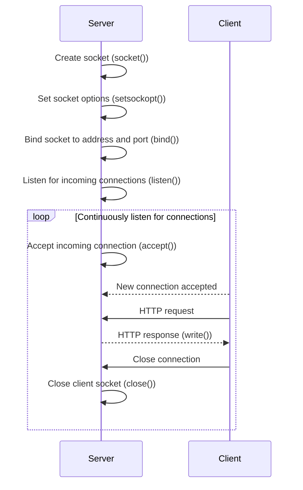

# c_networking

1) [basic_http_server.c](https://github.com/kbrault/c_networking/blob/master/src/basic_http_server.c)

```mermaid
sequenceDiagram
    participant Server
    participant Client

    Server ->> Server: Create socket (socket())
    Server ->> Server: Set socket options (setsockopt())
    Server ->> Server: Bind socket to address and port (bind())
    Server ->> Server: Listen for incoming connections (listen())

    loop Continuously listen for connections
        Server ->> Server: Accept incoming connection (accept())
        Client -->> Server: New connection accepted
        Client ->> Server: HTTP request
        Server -->> Client: HTTP response (write())
        Client ->> Server: Close connection
        Server ->> Server: Close client socket (close())
    end
```